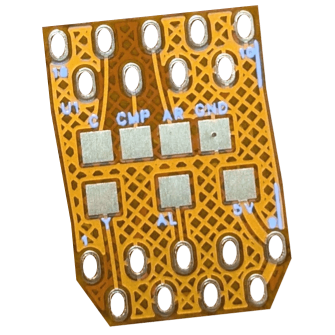
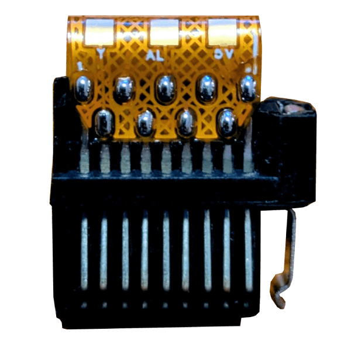

# iQue Player Xbox AV Flex
A simple helper flex PCB for creating an iQue player connector using an Xbox AV connector.

## Idea
The iQue player uses a custom cable connector which combines power delivery, video and audio (...and also additional controllers).
This cable is often lost.
A common modern way to DIY a replacement cable is to take the AV connector of an OG Xbox and trim it down.
By soldering to the right pins of the trimmed connector and using a 3D printed sleeve ([like HDR's one](https://github.com/HDR/iQue-Player-AV-Cable)), you can create your own replacement cable.

Though, the space for soldering the wires up to connector pins is rather limited.
To make the wiring a bit easier, I created this simple flex PCB which can be soldered to the pins of the connector.
It exposes a few solder pads for the cables to be soldered to.
It also ties all GNDs together.
**It only exposes power, video and audio signals (no addtional controller pins).**

## Pads
| Pad | Signal |
|-----|--------|
| C   | Chroma (S-Video) |
| CMP | Composite video |
| AR | Audio right |
| GND | Ground (all tied together) |
| Y | Luma (S-Video) |
| AL | Audio left |
| 5V | 5V supply |

## Install
Solder the flex PCB to the connector pins after trimming the connector.
The flex PCB edge with the white line should be aligned with the connector side which has the metal clip left over.
The PCB needs to be bend over to the other side after soldering one side.

## Disclaimer
**Use the files and/or schematics to build your own board at your own risk**.
This board works fine for me, but it's a simple hobby project, so there is no liability for errors in the schematics and/or board files.
**Use at your own risk**.
